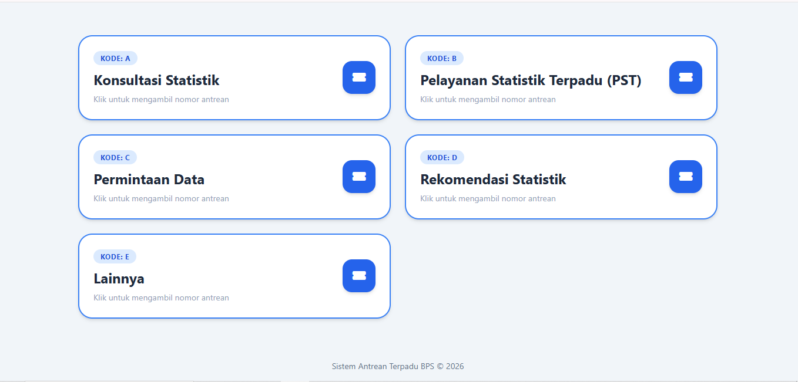
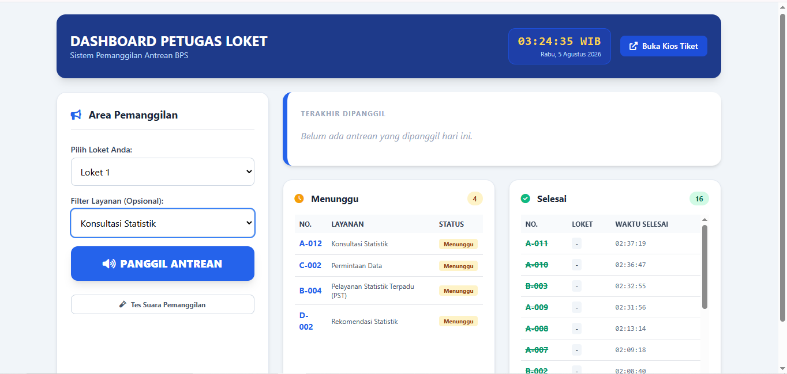
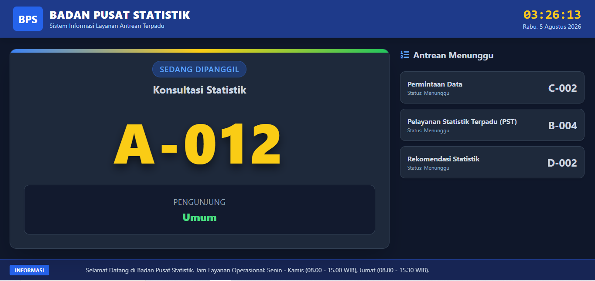

# 🎟️ Sistem Informasi Manajemen & Pemanggilan Antrean BPS

Aplikasi manajemen antrean berbasis web yang dirancang untuk mempermudah alur pelayanan publik pada kantor BPS (Badan Pusat Statistik). Aplikasi ini mengintegrasikan pengambilan tiket antrean, dashboard operasional petugas, serta pemanggilan suara otomatis (*Text-to-Speech*) berbasis AJAX real-time.

---

## 📸 Tampilan Aplikasi (Screenshots)

### 1. 🏢 Kios Tiket (Pengambilan Antrean)
Tampilan interface untuk pengunjung memilih jenis layanan dan mencetak nomor antrean.

<p align="center">
  
</p>

---

### 2. 👨‍💼 Dashboard Petugas (Petugas Loket)
Halaman operasional petugas untuk memanggil antrean via AJAX, memicu audio pemanggilan (*Voice Call*), serta mengubah status antrean.

<p align="center">
  
</p>

---

### 3. 🖥️ Display Monitor Utama
Layar monitor ruang tunggu yang menampilkan panggilan nomor antrean dan loket tujuan secara real-time.

<p align="center">
  
</p>

---

## 🚀 Fitur Utama

### 1. 🏢 Kios Tiket (Pengambilan Antrean)
- **Cetak/Ambil Nomor**: Pengunjung dapat memilih jenis layanan yang dibutuhkan dan memperoleh nomor antrean secara otomatis.
- **Format Nomor**: Penomoran antrean yang terstruktur sesuai jenis layanan.

### 2. 👨‍💼 Dashboard Petugas (Petugas Loket)
- **Pemanggilan Antrean Asinkron (AJAX)**: Memanggil antrean berikutnya tanpa perlu memuat ulang (*reload*) halaman.
- **Fitur Suara Otomatis (*Voice Call*)**: Mengintegrasikan API Speech Synthesis browser untuk memanggil nomor antrean dan lokasi loket secara otomatis.
- **Filter Layanan & Loket**: Petugas dapat memilih nomor loket dan memfilter antrean berdasarkan jenis layanan tertentu.
- **Manajemen Status**: Mengubah status antrean dari `Menunggu`, `Dipanggil`, hingga `Selesai`.

### 3. 🖥️ Display Monitor Utama
- Menampilkan nomor antrean yang sedang dipanggil beserta loket tujuannya secara *real-time* untuk dilihat oleh pengunjung di ruang tunggu.

---

## 🛠️ Spesifikasi & Teknologi

* **Framework Backend**: Laravel 12.x
* **Bahasa Pemrograman**: PHP 8.2+
* **Database**: MySQL / MariaDB
* **Frontend**: Blade Template, CSS/Tailwind CSS, JavaScript (Fetch API & Web Speech API)
* **Web Server**: Apache / Nginx (XAMPP / Artisan)

---

## 📁 Struktur Direktori Penting

```text
├── app/
│   ├── Http/
│   │   ├── Controllers/
│   │   │   └── PetugasController.php   # Logika bisnis pemanggilan & penyelesaian antrean
│   │   └── Middleware/
│   │       └── RoleMiddleware.php      # Autentikasi hak akses petugas
│   └── Models/
│       ├── Antrian.php                 # Model data antrean & status
│       └── Layanan.php                 # Model data jenis layanan
├── database/
│   ├── migrations/                     # Skema tabel database
│   └── seeders/                        # Data awal layanan & akun petugas
├── img/                                # Folder dokumentasi gambar screenshot
│   ├── kios-tiket.png
│   ├── dashboard-petugas.png
│   └── display-monitor.png
├── resources/
│   └── views/
│       └── petugas/
│           └── index.blade.php         # Tampilan dashboard petugas & script voice AJAX
└── routes/
    └── web.php                         # Routing aplikasi